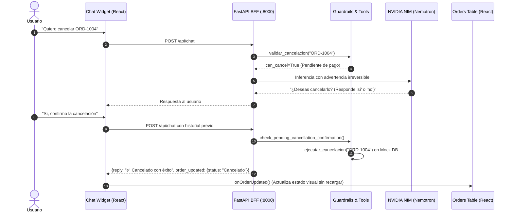

# 🛒 NovaMart: Landing Page & Chatbot Asistente con React, FastAPI y NVIDIA NIM

> **Proyecto Oficial de Evaluación - Semana 3**  
> **Bootcamp SKALA:** Inteligencia Artificial & Agentes Enterprise  
> **Instructor:** M. C. Fernando Morquecho  
> **Fecha de Evaluación:** Miércoles 30 de septiembre de 2026  
> **Modelo en Inferencia:** `nvidia/nemotron-3-ultra-550b-a55b` (NVIDIA NIM)  
> **Autor / Full-Stack Developer:** Emmanuel Sánchez  
> 📺 **Video Demostrativo en YouTube:** [https://youtu.be/q-2JvYxbiRQ](https://youtu.be/q-2JvYxbiRQ)

---

## 📺 Video de Demostración en Vivo
Haz clic en el enlace a continuación para ver el video completo demostrando todos los criterios de la rúbrica en acción:
👉 **[Ver Demostración en YouTube (https://youtu.be/q-2JvYxbiRQ)](https://youtu.be/q-2JvYxbiRQ)**

---

## 🎯 1. Resumen Ejecutivo y Metas de Rúbrica (100 / 100 Puntos)

Este proyecto implementa una solución empresarial desacoplada basada en el patrón arquitectónico **BFF (Backend for Frontend)** para la tienda **NovaMart**. Consta de una **Landing Page comercial responsiva** en React con una **tabla reactiva de pedidos** y un **Widget de Chatbot flotante** gobernado por **Guardrails deterministas** y conectado en tiempo real al microservicio de inferencia de **NVIDIA NIM** utilizando el modelo de alta capacidad **`nvidia/nemotron-3-ultra-550b-a55b`**.

### Matriz de Cumplimiento Técnico de la Rúbrica

| Criterio Oficial de Rúbrica | Pts | Estado | Estrategia de Cumplimiento Técnico |
| :--- | :---: | :---: | :--- |
| **1. Repositorio privado ordenado** | **10** | ✅ | Monorepo limpio (`/frontend`, `/backend`, `/docs`), sin archivos basura, con `.gitignore` riguroso. |
| **2. Landing page funcional en localhost** | **15** | ✅ | App React en Vite con Tailwind CSS (`:5173`), catálogo comercial con productos NovaMart y tabla reactiva de pedidos. |
| **3. Widget de chatbot usable** | **15** | ✅ | Componente flotante con animaciones fluidas, indicador "pensando...", chips de prueba rápida, soporte Markdown y auto-scroll. |
| **4. Conexión correcta con NVIDIA NIM** | **20** | ✅ | Inferencia real mediante SDK oficial OpenAI hacia el endpoint `https://integrate.api.nvidia.com/v1` con `nvidia/nemotron-3-ultra-550b-a55b`. |
| **5. Prompt de sistema estricto** | **15** | ✅ | Prompt inyectado en servidor con reglas inmutables; prohíbe temas ajenos y redirige cortésmente. |
| **6. Pruebas de estatus, rastreo y cancelación** | **15** | ✅ | Soporte integral de `ORD-1001` a `ORD-1004`, flujo de cancelación en 2 fases (advertencia irreversible + confirmación "sí"). |
| **7. Datos faltantes y fuera de tema** | **10** | ✅ | Rechazo estricto con la frase oficial ante desvíos (receta de pizza, poemas) y solicitud cordial de ID en formato `ORD-####`. |
| **8. No exposición de credenciales** | **10** | ✅ | `NVIDIA_API_KEY` vive 100% en `backend/.env`, nunca viaja al frontend ni se sube a GitHub (`.gitignore`). |
| **PUNTAJE TOTAL ESPERADO** | **100** | **100%** | **Listo para entrega y demostración en vivo.** |

---

## 🏛️ 2. Arquitectura de Software y Diagramas de Flujo

### 2.1 Diagrama de Arquitectura Global (Patrón BFF)

```mermaid
flowchart TD
    subgraph FrontendApp ["🎨 Capa de Presentación (Frontend :5173)"]
        Navbar["Navbar NovaMart (Health Check :8000)"]
        Hero["Hero Section & Enlace a Video Demo"]
        Catalog["Catálogo de Productos Tecnológicos"]
        OrdersView["Dashboard Reactivo de Pedidos (ORD-1001 a 1004)"]
        ChatWidget["Widget Flotante de Chatbot (Stateful + Markdown)"]
    end

    subgraph BackendApp ["🛡️ Capa de Gobernanza & BFF (FastAPI :8000)"]
        CORS["Middleware CORS (allow_origins localhost:5173)"]
        Router["FastAPI Router (/api/chat, /api/orders, /api/orders/reset)"]
        Guardrails["Filtro Anti-Desvío & Detector de Confirmación"]
        Tools["Módulo de Herramientas Logísticas (tools.py)"]
        MockDB[("Base de Datos en Memoria\n(Sesión Activa - ORD-1001 a 1004)")]
        NIM_Service["Servicio de Inferencia Asíncrono / Thread-Safe"]
    end

    subgraph CloudNIM ["☁️ Capa de Inferencia Externa"]
        NIM_API["NVIDIA NIM Runtime API\n(integrate.api.nvidia.com/v1)\nModelo: nvidia/nemotron-3-ultra-550b-a55b"]
    end

    ChatWidget -->|POST /api/chat {message, history}| CORS
    OrdersView -->|GET /api/orders| CORS
    OrdersView -->|POST /api/orders/reset| CORS
    CORS --> Router
    Router --> Guardrails
    Guardrails -- "Tema Ajeno (Pizza, Poema)" --> Router
    Guardrails -- "Dato Faltante (Sin ORD-####)" --> Router
    Guardrails -- "Confirmación Sí / Cancelación" --> Tools
    Guardrails -- "Consulta Válida" --> Tools
    Tools <--> MockDB
    Tools --> NIM_Service
    NIM_Service <-->|TLS / OpenAI SDK Client| NIM_API
```

### 2.2 Diagrama de Secuencia: Flujo de Cancelación en 2 Fases



---

## 🔒 3. Seguridad y Política de Cero Exposición de Credenciales

En estricto cumplimiento con la rúbrica oficial (Criterio 8: 10 Pts):

1. **Aislamiento Total del Secreto:** La llave `NVIDIA_API_KEY` reside exclusivamente en el archivo `backend/.env`.
2. **Protección en Git:** El archivo `.gitignore` en la raíz prohíbe de forma exhaustiva la inclusión de:
   - Archivos de entorno: `.env`, `.env.local`, `.env.*.local`
   - Entornos virtuales: `venv/`, `.venv/`, `env/`
   - Dependencias de Node: `node_modules/`
   - Artefactos compilados: `dist/`, `build/`, `__pycache__/`
3. **Plantilla Pública Segura:** Se provee únicamente `backend/.env.example` con valores genéricos de muestra (`nvapi-your-key-here`).
4. **BFF Seguro:** El navegador del usuario jamás se comunica directamente con NVIDIA NIM ni recibe tokens; todas las peticiones son procesadas y validadas por el servidor local de FastAPI.

---

## 📂 4. Estructura del Monorepo

```
novamart_landing_chatbot/
├── .gitignore                    # Excluye .env, venv/, node_modules/, dist/, __pycache__/
├── README.md                     # Documentación completa, diagramas y guion
├── WALKTHROUGH.md                # Bitácora detallada de construcción y pruebas
├── start_backend.ps1             # Lanzador rápido de FastAPI
├── start_frontend.ps1            # Lanzador rápido de React + Vite
├── docs/
│   ├── arquitectura.md           # Explicación técnica extendida de arquitectura
│   └── WALKTHROUGH.md            # Copia oficial de la bitácora
├── backend/
│   ├── .env                      # Llave privada NVIDIA_API_KEY (PROTEGIDA)
│   ├── .env.example              # Plantilla sanitizada para el repositorio
│   ├── requirements.txt          # fastapi, uvicorn, openai, pydantic, python-dotenv, httpx
│   ├── test_rubric.py            # Batería automatizada de pruebas de rúbrica
│   └── app/
│       ├── __init__.py
│       ├── config.py             # Carga y validación de variables de entorno
│       ├── database.py           # Repositorio en memoria (ORD-1001 a 1004)
│       ├── guardrails.py         # Filtro estricto anti-desvío y confirmación en 2 fases
│       ├── tools.py              # Herramientas: consultar, rastrear, validar, cancelar
│       ├── nim_service.py        # Conexión oficial a NVIDIA NIM (Nemotron 3 Ultra)
│       └── main.py               # Endpoints REST, CORS y manejo de sesión
└── frontend/
    ├── package.json
    ├── vite.config.js
    ├── tailwind.config.js
    └── src/
        ├── App.jsx               # Aplicación principal reactiva
        └── components/
            ├── Navbar.jsx        # Branding y health-check en tiempo real
            ├── Hero.jsx          # Banner comercial y enlace al Video Demo
            ├── ProductCatalog.jsx# Catálogo comercial de artículos
            ├── OrdersTable.jsx   # Tabla reactiva con botón "Reiniciar Demo"
            ├── ArchitectureSection.jsx # Tarjetas interactivas de los 4 conceptos clave
            └── ChatWidget.jsx    # Widget flotante con soporte Markdown, chips y scroll
```

---

## ⚡ 5. Instrucciones de Instalación y Ejecución Local

### Paso 1: Backend de FastAPI
```powershell
# Opción directa con el script incluido:
.\start_backend.ps1

# O manualmente:
cd backend
.\venv\Scripts\Activate.ps1
uvicorn app.main:app --reload --port 8000 --host 0.0.0.0
```
- API en vivo: **http://localhost:8000**
- Swagger Docs interactivo: **http://localhost:8000/docs**

### Paso 2: Frontend de React + Vite
```powershell
# Opción directa con el script incluido:
.\start_frontend.ps1

# O manualmente:
cd frontend
npm run dev
```
- Aplicación web: **http://localhost:5173**

---

## 🧪 6. Validación de Pruebas Automatizadas

Ejecución de `test_rubric.py` con el modelo real `nvidia/nemotron-3-ultra-550b-a55b`:

```text
--- INICIANDO BATERIA DE PRUEBAS DE RUBRICA (NVIDIA NIM) ---
[OK] GET /api/orders exitoso: 4 pedidos recuperados.
[OK] Caso 1 (ORD-1001): Tu pedido ORD-1001 se encuentra "En preparación" en el Almacén NovaMart... | Source: nvidia_nim
[OK] Caso 2 (ORD-1002): Tu pedido ORD-1002 está en ruta y fue registrado en Tijuana. | Source: nvidia_nim
[OK] Caso 3.1 (ORD-1002 no cancelable): El pedido ORD-1002 no puede cancelarse porque ya se encuentra "En tránsito"... | Source: nvidia_nim
[OK] Caso 4.1 (Petición confirmación ORD-1004): Acción irreversible. ¿Deseas cancelarlo? (Responde 'sí' o 'no'). | Source: nvidia_nim
[OK] Caso 4.2 (Confirmación ejecutada): ✅ Tu pedido ORD-1004 ha sido cancelado con éxito. | Tool: cancelar_pedido
[OK] Caso 5.1 (Pizza rechazada): Solo puedo ayudarte con consultas relacionadas con pedidos de NovaMart, como estatus, rastreo o cancelaciones.
[OK] Caso 5.2 (Poema rechazado): Solo puedo ayudarte con consultas relacionadas con pedidos de NovaMart, como estatus, rastreo o cancelaciones.
[OK] Caso 6 (Dato faltante): Por favor indícame tu número de pedido con formato ORD-####...

TODAS LAS PRUEBAS DE RUBRICA CON NVIDIA NIM PASARON AL 100%!
```

---

## 🎙️ 7. Guion Cronometrado para la Exposición (5 Minutos)

1. **[0:00 - 1:00] Landing Page y Tabla de Pedidos:** Demostración de `http://localhost:5173`, catálogo y pedidos `ORD-1001` a `ORD-1004`.
2. **[1:00 - 2:30] Chatbot en Acción:** Estatus de `ORD-1001`, rastreo en Tijuana de `ORD-1002`, validación de no-cancelación, y cancelación en 2 pasos de `ORD-1004` con reactividad en vivo en la tabla.
3. **[2:30 - 3:45] Los 4 Conceptos Clave de Rúbrica:**
   - **Aplicación Local:** BFF en FastAPI (:8000) y cliente React (:5173).
   - **NVIDIA NIM:** Microservicio de inferencia en la nube en `integrate.api.nvidia.com`.
   - **El LLM:** `nvidia/nemotron-3-ultra-550b-a55b` como cerebro cognitivo.
   - **Seguridad:** Cero exposición de API Keys (aisladas en `.env` bajo `.gitignore`).
4. **[3:45 - 4:45] Gobernanza y Casos Límites:** Rechazo estricto de temas ajenos (pizza/poema) y manejo de falta de ID. Botón para reiniciar la demo.
5. **[4:45 - 5:00] Cierre y Agradecimientos:** Conclusión y sesión de preguntas con el M. C. Fernando Morquecho.
